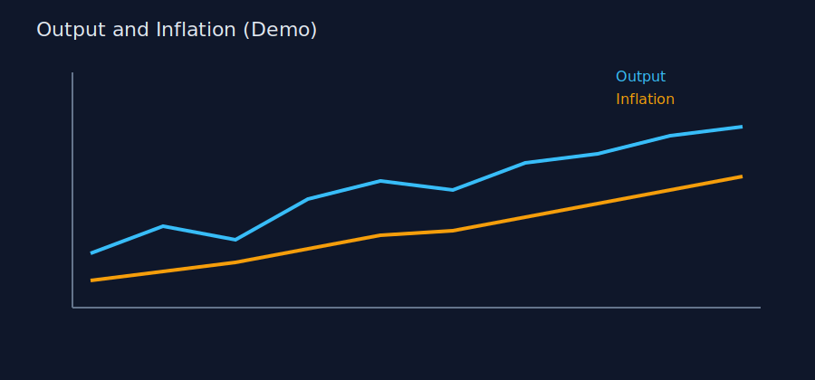
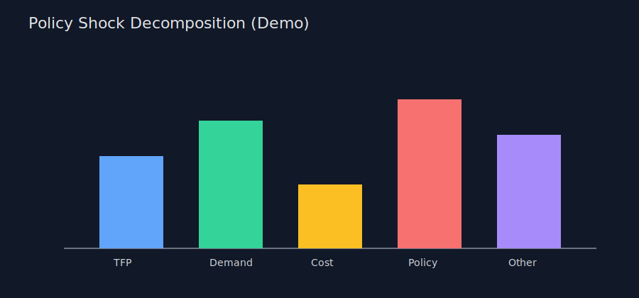
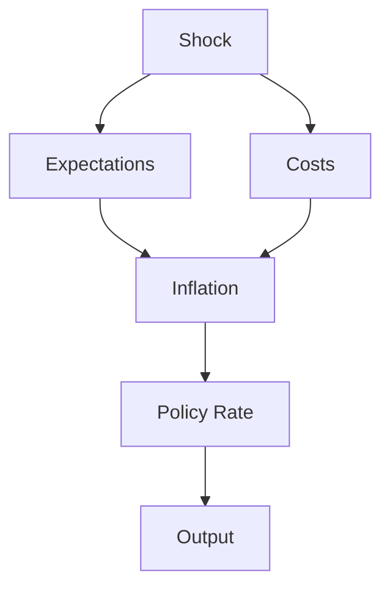

# Markdown Images + Graphs Test

This file stress-tests image and graph rendering in your preview.

## 1. Local SVG Graph (Line)

## 2. Local SVG Graph (Bars)

## 3. Mermaid Graph

## 4. Remote Image Test

## 5. Wide Table

| Year | GDP Growth | Inflation | Policy Rate | Note |
|---|---:|---:|---:|---|
| 2022 | 2.1 | 4.8 | 3.0 | Catch-up demand |
| 2023 | 1.6 | 3.9 | 4.5 | Tightening cycle |
| 2024 | 1.9 | 2.9 | 4.0 | Disinflation begins |
| 2025 | 2.0 | 2.4 | 3.5 | Near target |

If images render but Mermaid does not, we can enable Mermaid-specific settings next.
